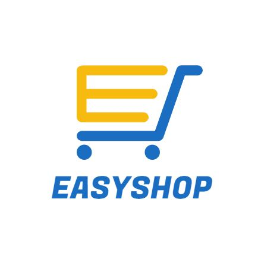
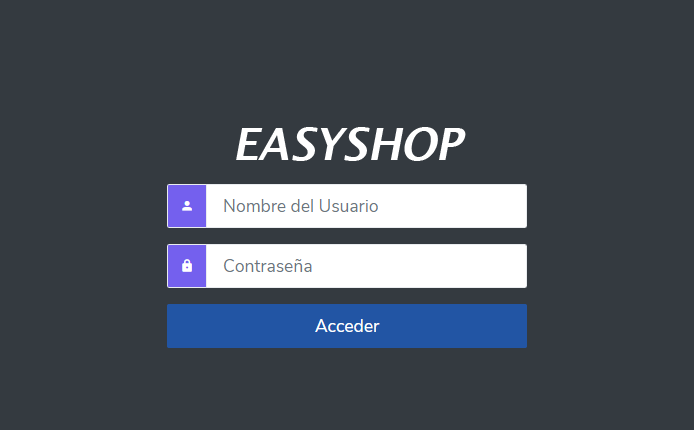
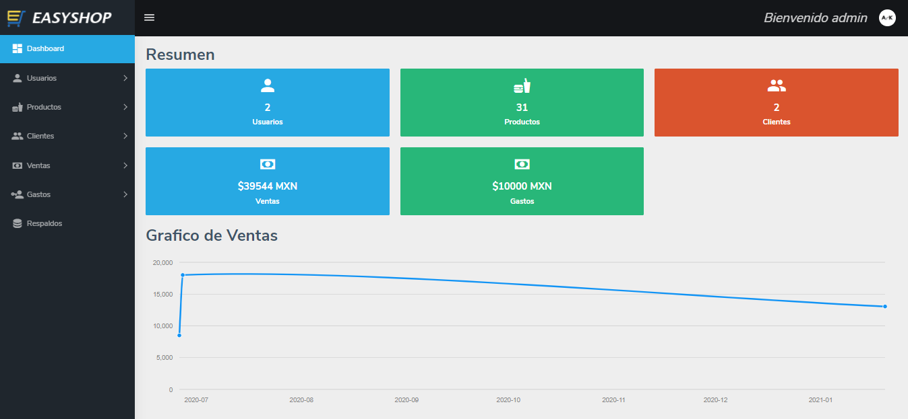
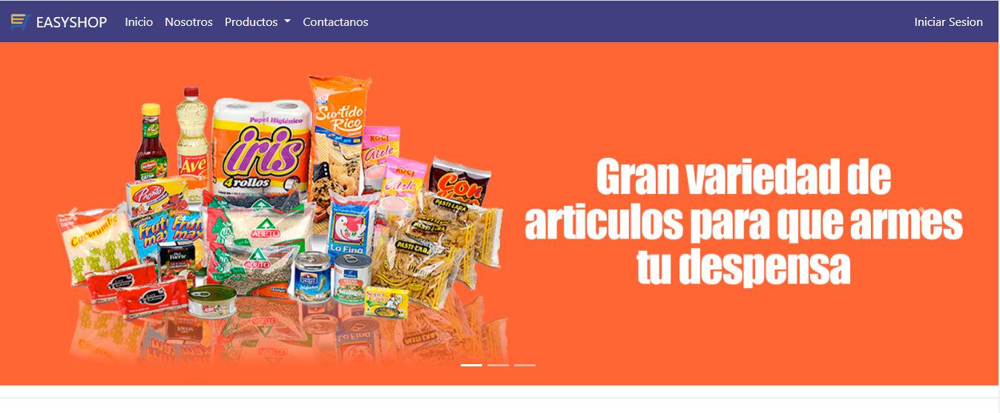
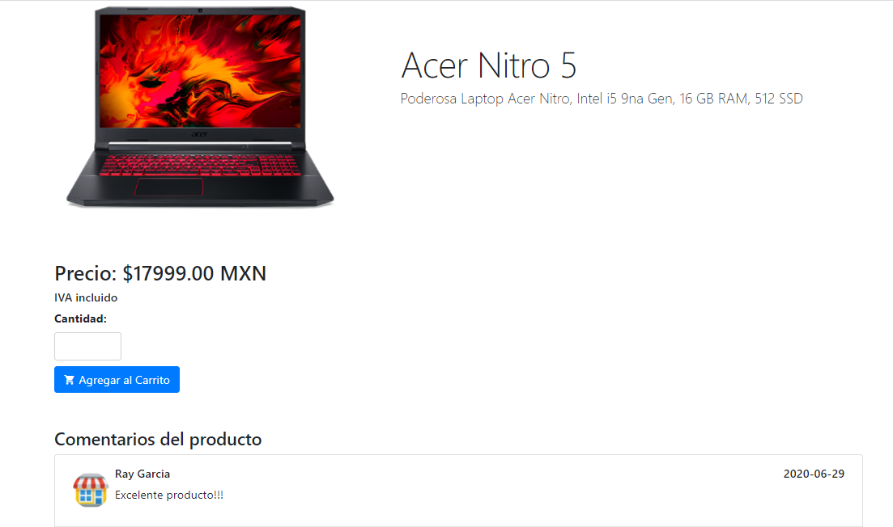
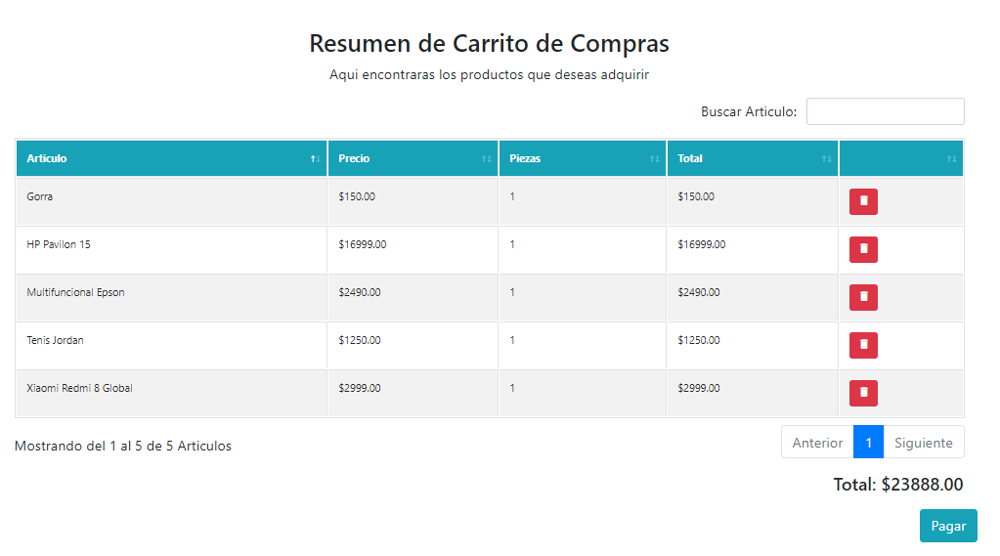

# EASYSHOP



EASYSHOP es un proyecto de un sitio de comercio electronico (Ecommerce en Ingles), el cual simula la venta de diferentes articulos los cuales se acreditan con ayuda de la plataforma de pagos de PayPal. Adicionalmente cuenta con su Panel de Administración para controlar los articulos, clientes y ventas que tiene el negocio/plataforma.

## Antes de Utilizar

### Conexión a la Base de Datos

El primer paso para poder hacer uso del EASYSHOP es preparar las conexiones a la Base de datos, para ello es importante editar algunos archivos de PHP (admin/includes/conexion.php e includes/conexion.php, adicionalmente revisar los archivos de respaldos)

Encontraras una estructura similar en los archivos de conexión.

Nota: La base de datos la encontraras en la carpeta database...

```php
<?php
    //Variables de Conexion, editar por tus datos de conexión
    $hostname="localhost"; 
    $database="";
    $username=""; 
    $password=""; 

    // Establecimiento de la conexion a la BD
    $conexion=mysqli_connect($hostname,$username,$password,$database); 

    // Verificamos que la conexion sea exitosa
    if ($conexion->connect_error) {
        die("La conexion fallo: " . $conn->connect_error);
    }  

  }
```

### Pagos con PayPal

En este proyecto se usa la pasarela de pagos de PayPal, por ello tenemos que editar un archivo para que el SDK de PayPal pueda funcionar correctamente. Buscaremos el archivo de configuracion de las claves (Estas se generan en tu PayPal Developer) llamado config.php y agregaremos las claves

```php
<?php
/**
 * Archivo de configuració
 * @var URL_SITIO define la ruta de nuestro proyecto para configurar el exito o no de
 * la transacción
 */
define('URL_SITIO', ''); // Podria ser una URL como localhost/Easyshop

// importación de paquetes de composer
require 'paypal/autoload.php';

// agregamos las llaves del cliente y la secreta para trabajar con la API REST de PAYPAL
$apiContext = new \PayPal\Rest\ApiContext(
    new \PayPal\Auth\OAuthTokenCredential(
        '',// ClientID
        '' // ClientSecret
    )
);

);
```

## Uso del Software

### Panel de Administración

EASYSHOP cuenta con un Panel de Administración... Las credenciales por defecto para ingresar son:

- Usuario: admin
- Contraseña: 123

En este panel podras consultar y manipular diferentes modulos, entre ellos:
- Administración de Usuarios
- Manipulación de Catalogo de Productos 
- Consulta de Clientes
- Consulta de Ventas y sus detalles
- Manipulación de Gastos
- Generacion y Restauración de Respaldos

Para acceder a el tecla la ruta localhost/NombreDelProyecto/admin

## Capturas
### Panel de Administración
 



### Pagina Principal


### Productos




### Carrito de Compras


## Tecnologías Empleadas 

- HTML 5
- CSS 3
- PHP en su Versión 7.3
- Javascript ES6
- AJAX
- MySQL como motor de BD
- Boostrap 4 (Framework de Diseño)
- PayPal como plataforma de pagos
- Entre otras tecnologias

